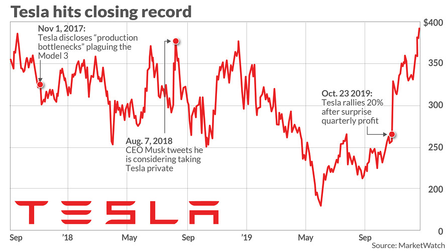

# 📈 Time-Series Forecasting of Tesla Stock Prices using ARIMA and LSTM
> Comparative analysis of ARIMA and LSTM models for forecasting Tesla’s daily stock prices.


<p align="center">
  
</p>


This project focuses on **forecasting Tesla’s daily stock prices** using two distinct time-series approaches — a **traditional ARIMA model** and a **deep learning-based LSTM model**.  
It also includes **rolling window evaluation**, performance comparison, and a **deployed Gradio demo on Hugging Face**.

---

## 🚀 Project Overview

The goal of this project was to analyze Tesla’s historical stock prices and predict future values.  
Both classical statistical and deep learning methods were explored to compare performance and generalization.

**Key objectives:**
- Implement ARIMA for univariate forecasting.
- Build and train an LSTM model on sequential data.
- Evaluate using RMSE and MAPE.
- Conduct rolling window forecasting.
- Deploy the final model as an interactive Gradio web app.

---

## 🧠 Models Implemented

### 🔹 ARIMA (AutoRegressive Integrated Moving Average)
- Used **ADF test** to determine the order of differencing (d).  
- Leveraged **Auto-ARIMA** to automatically find optimal parameters (p, d, q).  
- Dataset split: **80% training**, **20% testing**.  
- Forecast evaluated on both standard and rolling-window approaches.

### 🔹 LSTM (Long Short-Term Memory)
- Input features: `['Close', 'Open', 'High', 'Low', 'Volume']`
- Target variable: `Close`
- Data split: **70% training**, **10% validation**, **20% testing**
- Architecture:
  - LSTM(64, return_sequences=True)
  - LSTM(64)
  - Dense(32, ReLU) → Dense(1)
- Optimizer: Adam (lr = 0.001)
- Loss: MSE, Metrics: MAE
- EarlyStopping + ReduceLROnPlateau used for stabilization.

---

## 📊 Results & Comparison

| Model           | RMSE (↓) | MAPE (%) (↓) |
|-----------------|-----------|--------------|
| ARIMA (baseline) | 76.99 | 29.71 |
| ARIMA (rolling)  | 9.88  | 2.85  |
| LSTM (baseline)  | 19.74 | 5.94  |
| LSTM (rolling)   | 21.86 | 7.15  |

**Insight:**  
The rolling-window evaluation significantly improved performance for both models, particularly ARIMA.  
While LSTM captured short-term patterns better, ARIMA generalized more consistently over time.

---

## 🧩 Deployment

A Gradio app was built for interactive forecasting.  
Users can select the number of days ahead and visualize predicted prices.

🔗 **Live Demo:** [Hugging Face Space](https://huggingface.co/spaces/foyez767/DataSynthis_ML_JobTask)

---

## 📓 Notebook & Resources

- **Notebook:** [Kaggle Notebook](https://www.kaggle.com/code/foyez767/tesla-stock-price-arima-vs-lstm)
- **Dataset:** Yahoo Finance (via `yfinance`)
- **Frameworks:** TensorFlow, scikit-learn, pmdarima, Gradio

---

## 🧾 Key Learnings

- ARIMA remains a strong baseline for univariate time-series data.
- LSTM models require more tuning and are sensitive to sequence window size and volatility.
- Rolling evaluation provides a more realistic estimate of predictive stability.

---
## ⚙️ Setup & Run Locally

Follow these steps to run the project on your local machine:

### 1️⃣ Clone the repository
```bash
git clone https://github.com/Foyez-Ahmed-Dewan/Tesla-Stock-Forecasting-ARIMA-vs-LSTM.git
```
### 2️⃣ Install dependencies
```bash
pip install -r requirements.txt
```
### 3️⃣ Run the Gradio app
```bash
python app.py
```

## 👤 Author

**Foyez Ahmed Dewan**  
Undergraduate Student, CSE – Rajshahi University of Engineering & Technology (RUET)  
📧 foyez.ruet767@gmail.com  
🌐 [LinkedIn](https://www.linkedin.com/in/foyez767)

---

> 🧭 *“The best way to learn machine learning is by doing — exploring, failing, fixing, and deploying.”*
